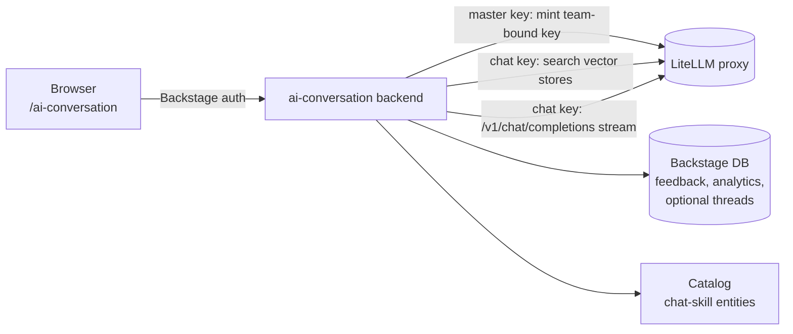

# AI Conversation for Backstage

[](https://www.npmjs.com/package/@acarmisc/backstage-plugin-ai-conversation)
[](https://www.npmjs.com/package/@acarmisc/backstage-plugin-ai-conversation-backend)
[](https://github.com/acarmisc/backstage-plugin-ai-conversation/actions/workflows/ci.yml)
[](LICENSE)

A fast chat page for Backstage users, on top of your
[LiteLLM](https://github.com/BerriAI/litellm) gateway. Every conversation runs
on a short-lived key bound to one of the user's LiteLLM teams, so budgets,
rate limits and model access come from the governance you already have.

- **Chat** — streaming answers with Markdown, code, tables and LaTeX; copy,
  regenerate, edit and resend, thumbs up/down.
- **Grounded answers** — pick knowledge bases (LiteLLM vector stores) and see
  the sources of each reply; optional web search; `#https://…` adds a web
  page as context.
- **Teams first** — the team picker scopes the models and knowledge bases you
  can choose, and its budget applies to the conversation.
- **Skills** — reusable system prompts authored as `SKILL.md` files or catalog
  entities, plus tone, focus, verbosity and reasoning-effort controls.
- **Compare** — the same prompt to two or three models, side by side.
- **Conversations** — grouped by date, searchable, pinnable, renamable;
  export as JSON or Markdown, import; stored in the browser or, if enabled,
  in your Backstage database.
- **Quick to use** — welcome screen with skills and starter prompts, quick
  pickers in the composer, image paste and drag & drop, keyboard shortcuts,
  light and dark themes.
- **Analytics** — usage per skill and model, and feedback totals.

| Start a conversation | Grounded answer with sources |
| --- | --- |
|  |  |
| **Quick pickers** | **Tune the conversation** |
|  |  |
| **Compare models** | **Dark theme** |
|  |  |

More screens in the [user guide](docs/user-guide.md).

## How it works



The browser only talks to the backend plugin. The backend mints a short-lived
key per conversation with the LiteLLM master key, bound to a team the user
belongs to and capped at a configured budget. It then retrieves context from
the selected knowledge bases, adds the skill and style prompts on the server,
and streams the model's answer back. Details in
[docs/architecture.md](docs/architecture.md).

## Packages

| Package | What it does |
| --- | --- |
| [`@acarmisc/backstage-plugin-ai-conversation`](packages/plugin-ai-conversation) | Frontend: the `/ai-conversation` chat page and `/ai-conversation/analytics` |
| [`@acarmisc/backstage-plugin-ai-conversation-backend`](packages/plugin-ai-conversation-backend) | Backend: chat keys, retrieval, streaming proxy, skills, threads, feedback |

## Requirements

- Backstage on the [new frontend system](https://backstage.io/docs/frontend-system/)
  and the [new backend system](https://backstage.io/docs/backend-system/).
- A LiteLLM proxy with its database (users, teams, keys) and its master key.
  Knowledge bases are LiteLLM vector stores.
- The [LiteLLM Governance plugin](https://github.com/acarmisc/backstage-plugin-litellm-govai)
  (`@acarmisc/backstage-plugin-litellm` and `-backend`): the chat page uses its
  API for teams and models (which also provisions the LiteLLM user on first
  use) and its Backstage-to-LiteLLM user mapping.
- Users in the Backstage catalog, members of at least one LiteLLM team.

## Getting started

1. Install the packages (next to the governance plugin):

   ```bash
   yarn --cwd packages/backend add @acarmisc/backstage-plugin-ai-conversation-backend
   yarn --cwd packages/app add @acarmisc/backstage-plugin-ai-conversation
   ```

2. Register the backend in `packages/backend/src/index.ts`:

   ```ts
   backend.add(import('@acarmisc/backstage-plugin-ai-conversation-backend'));
   ```

3. Add the frontend plugin to your app (skip this if your app discovers
   features from installed packages):

   ```ts
   import aiConversationPlugin from '@acarmisc/backstage-plugin-ai-conversation';

   const app = createApp({ features: [aiConversationPlugin /* , ... */] });
   ```

   Add a sidebar link to `/ai-conversation`.

4. Configure `app-config.yaml`. The LiteLLM keys are shared with the
   governance plugin:

   ```yaml
   litellm:
     baseUrl: http://litellm:4000
     masterKey: ${LITELLM_MASTER_KEY}
     aiConversation:
       defaultModel: gpt-4o
       maxRequestBudget: 5        # USD per conversation key
   ```

5. If your app sets a Content Security Policy, allow `fonts.googleapis.com`,
   `fonts.gstatic.com` and `cdn.jsdelivr.net` (code font and KaTeX styles).

## Configuration at a glance

| Key (under `litellm.aiConversation`) | Default | Purpose |
| --- | --- | --- |
| `defaultModel` | — | Model preselected for new conversations |
| `defaultVectorStoreIds` | — | Knowledge bases preselected |
| `maxRequestBudget` | — | USD budget of each conversation key, enforced by the backend |
| `teamRequired` | `true` | Conversations must run on a team key |
| `excludedModels` | — | Models hidden from the picker (`prefix*` allowed) |
| `multimodalModels` | heuristic | Models that accept image attachments |
| `persistence.enabled` / `ttlDays` | `false` / `30` | Store conversations in the Backstage database |
| `skills.sources` / `bundledPath` | bundled, catalog | Where skills come from |

All keys, with examples: [docs/configuration.md](docs/configuration.md).

## Documentation

| Page | Contents |
| --- | --- |
| [User guide](docs/user-guide.md) | The chat page, pickers, sources, compare, shortcuts |
| [Configuration](docs/configuration.md) | Every configuration key |
| [Skills](docs/skills.md) | Writing skills as `SKILL.md` files or catalog entities |
| [Architecture](docs/architecture.md) | Request flow, keys, retrieval, streaming, storage |
| [API](docs/api.md) | Backend routes |
| [Troubleshooting](docs/troubleshooting.md) | Common errors and fixes |
| [Development](docs/development.md) | Dev harness, tests, screenshots, releases |
| [Security](SECURITY.md) | Threat model and reporting |
| [Contributing](CONTRIBUTING.md) | How to contribute |

## License

[Apache-2.0](LICENSE)
