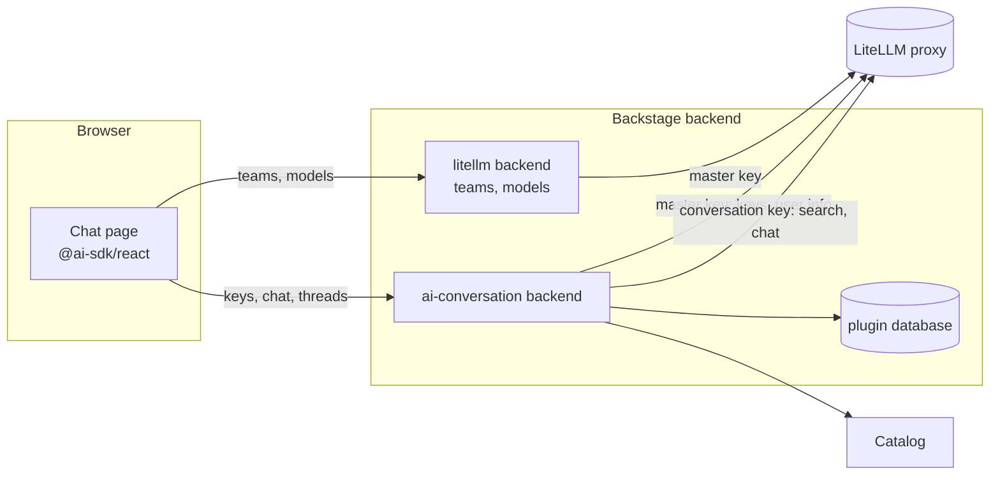
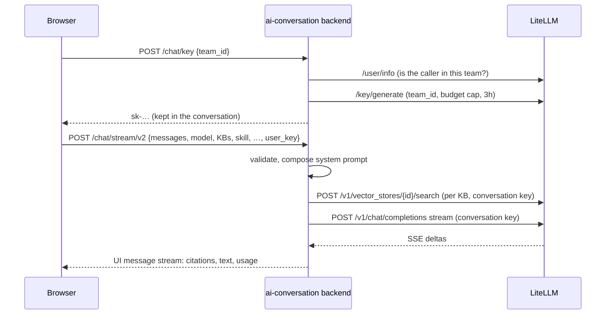

# Architecture

The plugin is a thin client over LiteLLM. LiteLLM owns models, keys, budgets,
rate limits and vector stores; Backstage adds identity, the UI, prompt
composition and a streaming proxy. Identity mapping, teams and models are
reused from the [LiteLLM Governance plugin](https://github.com/acarmisc/backstage-plugin-litellm-govai).

## A turn, step by step

### Keys

The first message of a conversation mints a key with the master key. It is
bound to a team the user belongs to (checked against LiteLLM's `/user/info`),
so LiteLLM applies that team's model allowlist, budget and rate limits on
every call. The key expires after 3 hours and its budget is capped at
`maxRequestBudget`. It lives only in the browser's copy of the conversation:
exports and server-side storage never include it. An expired or rejected key
is replaced automatically and the turn is retried once. Switching team, or
deleting the conversation, deletes the key; the backend only deletes chat keys
the caller owns.

### Retrieval

When knowledge bases are selected, the backend searches each one through
LiteLLM (`/v1/vector_stores/{id}/search`, first with the form Bedrock
knowledge bases expect, then plain on a 400) and adds the passages as a
numbered system message. The same passages go to the browser as a
`data-citations` part, shown in the Sources panel. A failed search is logged
and the turn continues ungrounded.

### Prompts

The skill prompt, tone, focus, verbosity and the user's extra instructions
are composed on the server from ids, so users can't edit a skill's prompt by
tampering with the browser. See [skills](skills.md#how-the-system-prompt-is-built).

### Streaming

`/chat/stream/v2` calls LiteLLM with `stream: true` and re-emits its
server-sent events as an AI SDK UI message stream, which the frontend's
`@ai-sdk/react` consumes. There is a 30-second timeout until LiteLLM answers
and a 120-second timeout between chunks, so long answers are never cut off
by a total deadline. Compare mode runs one stream per model in parallel.

### Storage

| What | Where |
| --- | --- |
| Conversations | The browser's `localStorage`, per user. With `persistence.enabled`, also the `chat_threads` table, which becomes the source of truth; old ones are deleted after `ttlDays` by a scheduled task that runs once across replicas |
| Feedback | `chat_message_feedback`: the vote and a snapshot of the question and answer |
| Analytics | `chat_events`: one row per turn (conversation id, user, model, skill, grounded); no message content |

## Packages

| Package | Main parts |
| --- | --- |
| Frontend | `ChatPage` (layout and key handling), `useThreads` (conversations, streaming via `@ai-sdk/react`, compare mode, persistence sync), components for the sidebar, composer, messages and context panel |
| Backend | `router.ts` (routes), `guards.ts` (validation, redaction), `uiMessageStream.ts` (stream adapter), `rag.ts` (retrieval), `skills.ts` and `traits.ts` (prompts), `attachments.ts`, `urlContext.ts` (SSRF-guarded fetch), `persistence.ts` |

Security notes and known gaps are in [SECURITY.md](../SECURITY.md).
