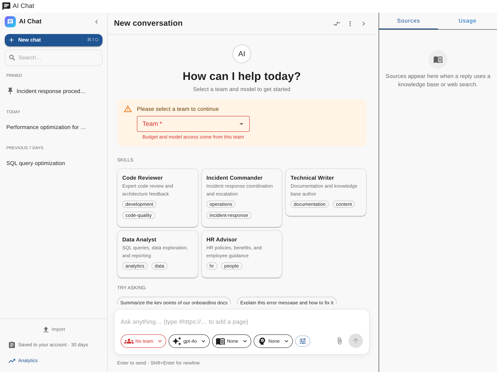
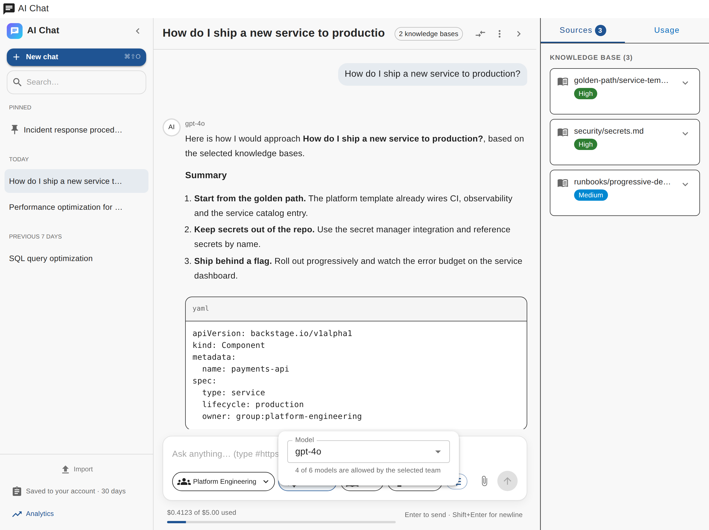
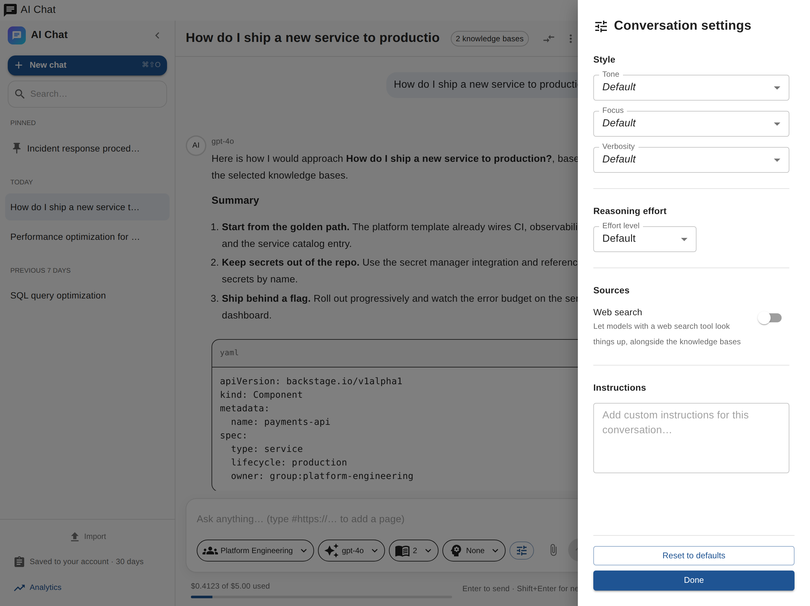
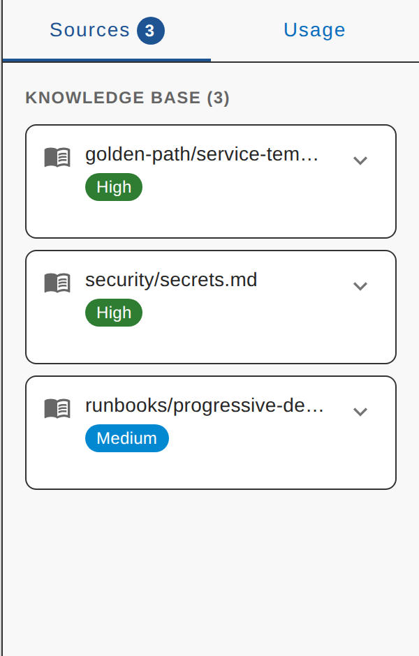
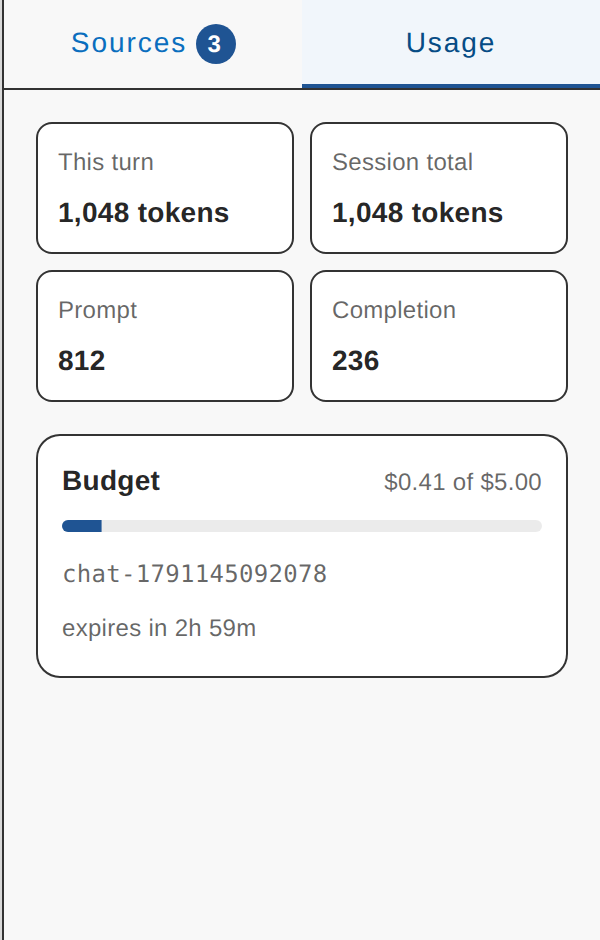
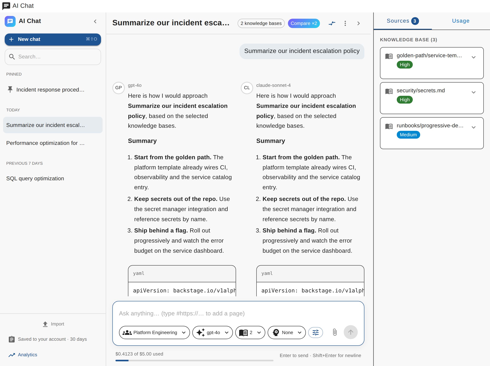
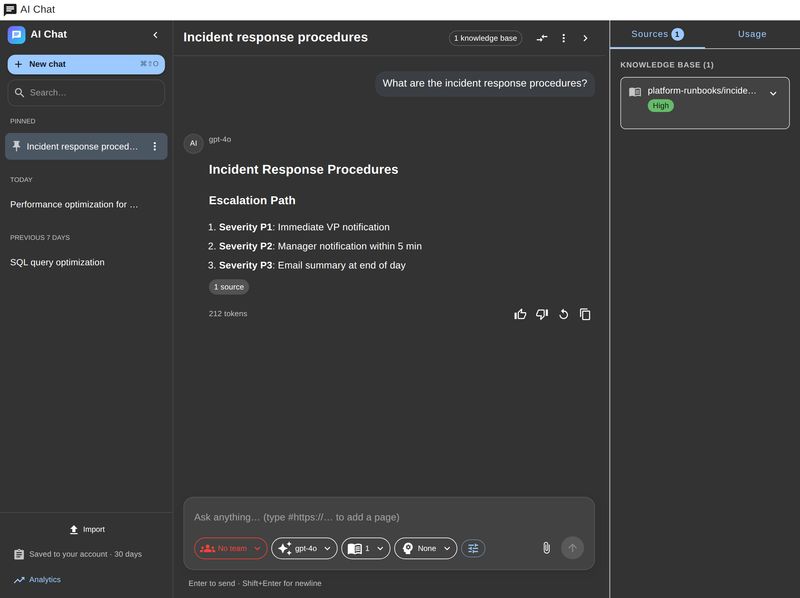
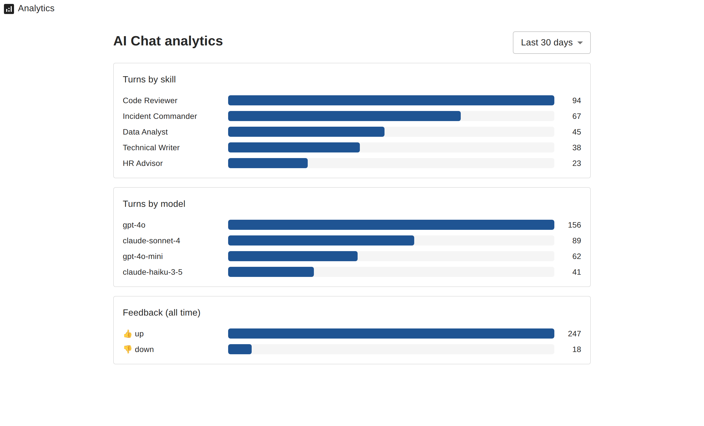

# User guide

The chat page lives at `/ai-conversation`. It has three columns: your
conversations on the left, the conversation in the middle, and the sources
and usage of the latest reply on the right.

## Starting a conversation

Open the page and type. A new conversation starts with your first message;
**New chat** (or <kbd>⌘/Ctrl</kbd>+<kbd>Shift</kbd>+<kbd>O</kbd>) starts
another one.

The welcome screen shows the team and model you're about to use, the skills
you can pick from, and a few starter prompts that fill the composer.

### Team

Every conversation runs on a key bound to one of your LiteLLM teams. The
team decides which models you can call, the budget and the rate limits. If
you belong to one team it's selected for you; otherwise pick one in the
**Team** picker (the welcome screen asks for it when it's missing). Switching
team replaces the conversation's key and narrows the model and knowledge base
pickers to what that team can use.

## The composer

The buttons under the message box change the next turn of this conversation:

| Picker | What it does |
| --- | --- |
| **Team** | The team the conversation's key belongs to |
| **Model** | The model that answers; only models your team can call are listed |
| **Knowledge** | Knowledge bases to search before answering; the team's own are preselected |
| **Skill** | A system prompt preset (for example *Code Reviewer*); it may preselect a model and knowledge bases |
| **Tune** | Style and advanced options (below) |

Other inputs:

- **Images** — attach with the paperclip, paste from the clipboard or drop
  them on the composer (PNG, JPEG, WebP or GIF, up to 4 per message), for
  models that accept images.
- **Web pages** — type `#https://example.com/page` in your message: the page
  is fetched by the server and added as context for that message.
- **Budget** — the line under the composer shows what the conversation's key
  has spent out of its budget.

### Tune

| Setting | Effect |
| --- | --- |
| Tone | Friendly, formal, direct, Socratic or playful |
| Focus | Explain reasoning, actionable, code-first, business impact, or risk & edge cases |
| Verbosity | Concise, balanced or thorough |
| Reasoning effort | Low, medium or high, for models that support it; *Model default* sends nothing |
| Web search | Lets models with a web search tool look things up, alongside the knowledge bases |
| Extra instructions | Your own system instructions for this conversation |

Tone, focus and verbosity are added to the skill's prompt on the server, so
any skill works with any style.

## Reading answers

- Code blocks have a copy button; tables scroll sideways; LaTeX is rendered.
- Under each answer: copy, regenerate, 👍 / 👎 (feedback for the analytics
  page), and **N sources** when the answer used a knowledge base or the web.
- Hover your own message to copy it or edit and resend it (the conversation
  continues from there).
- While an answer streams, the view follows it unless you scroll up; the
  arrow button brings you back to the end. <kbd>Esc</kbd> stops the answer.

### Sources and usage

| Sources | Usage |
| --- | --- |
|  |  |

**Sources** lists the documents behind the latest answer, grouped by
knowledge base or web, with a relevance label and the matching passages.
**Usage** shows the tokens of the last turn and of the whole conversation,
and the key's spend, budget and expiry. Drag the panel edge to resize it, or
hide it from the header.

## Compare models

The compare button in the header sends each message to two or three models
at once and shows their answers side by side. Pick the models from those your
team can call; turn it off from the same button.

## Managing conversations

- Conversations are grouped by date (Pinned, Today, Yesterday, Previous 7
  days, Previous 30 days, Older) and searchable by title and content
  (<kbd>⌘/Ctrl</kbd>+<kbd>K</kbd>).
- The **⋯** menu of a conversation: Rename (or double-click it), Pin, Export
  JSON, Export Markdown, Delete.
- The header menu: Copy as Markdown, Export Markdown, Export JSON, Keyboard
  shortcuts. Click the title to rename.
- **Import** (sidebar footer) loads a JSON export. Exports never contain the
  conversation's key.
- The footer says where conversations are kept: in this browser only, or in
  your account (with the retention period) when the operator enabled
  server-side storage.

## Keyboard shortcuts

| Keys | Action |
| --- | --- |
| <kbd>Enter</kbd> / <kbd>Shift</kbd>+<kbd>Enter</kbd> | Send / new line |
| <kbd>⌘/Ctrl</kbd>+<kbd>Shift</kbd>+<kbd>O</kbd> | New chat |
| <kbd>⌘/Ctrl</kbd>+<kbd>K</kbd> | Search conversations |
| <kbd>⌘/Ctrl</kbd>+<kbd>B</kbd> | Show or hide the sidebar |
| <kbd>/</kbd> | Focus the message box |
| <kbd>Esc</kbd> | Stop the answer |

## Errors

| Message | What to do |
| --- | --- |
| Select a team | Pick a team in the Team picker |
| Your chat key was rejected | Send again: a new key is minted automatically. If it keeps failing, check your team membership |
| Budget exhausted | The conversation key or the team ran out of budget; ask your team admin |
| Rate limited | Wait a moment and retry |
| Can't reach the chat service | The backend or LiteLLM is down or unreachable |

More in [troubleshooting](troubleshooting.md).

## Dark theme

The page follows the Backstage theme.

## Analytics

`/ai-conversation/analytics` shows conversation turns per skill and per
model, and feedback totals. It only shows aggregate counts.

